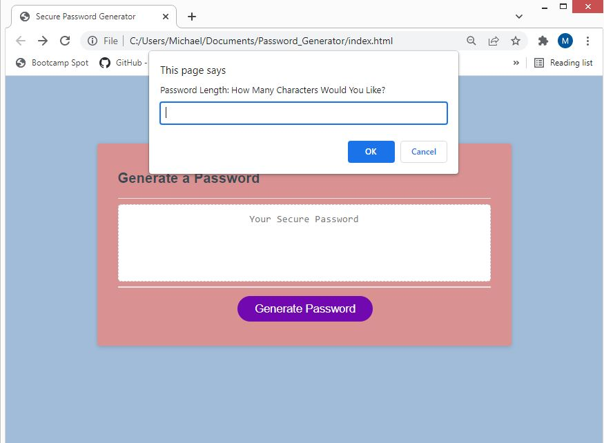
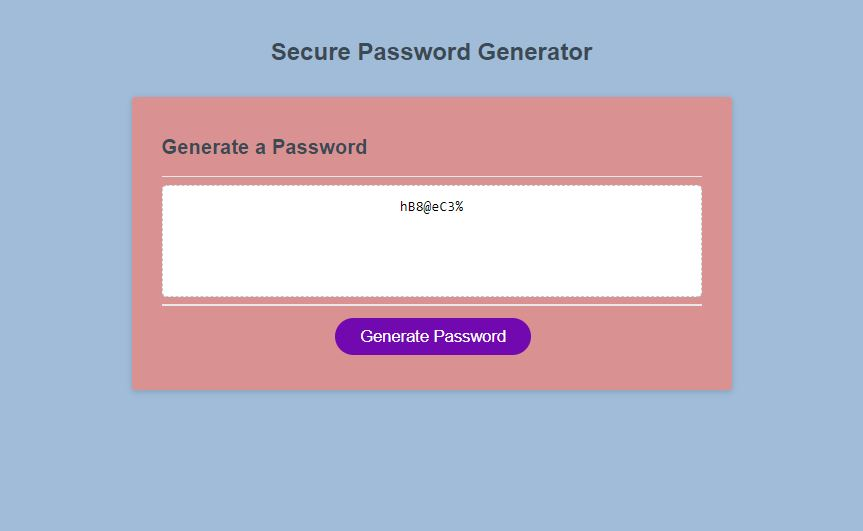
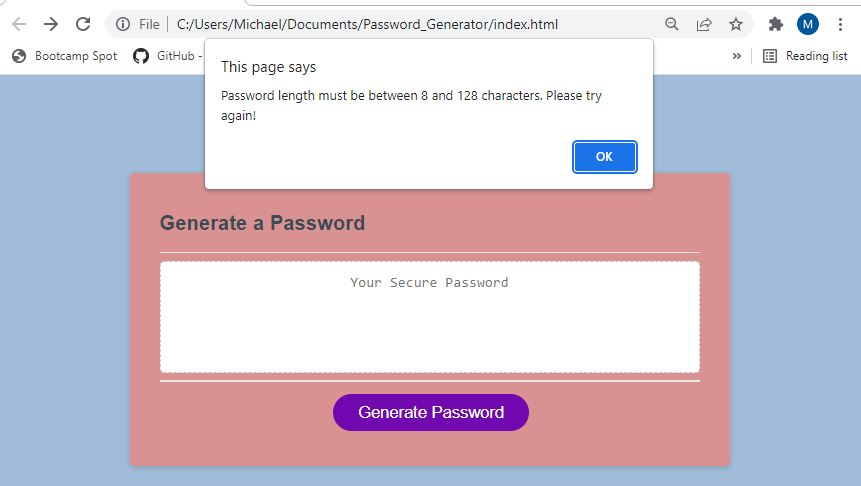
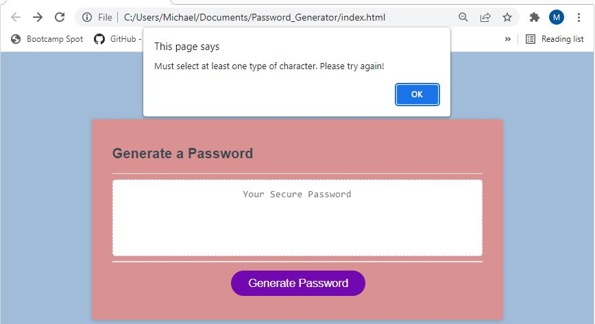

# Password_Generator

## Description

For this project, I was tasked with creating a secure password generator that will provide the user a way to create random and secure passwords for their accounts. This application lets the user choose the length of the password, as well as which type of characters they would like to use, including lowercase, uppercase, numeric and special characters, to ensure compliance with different web platforms and company security protocols.

## Link to deployed application:

https://mdschenck.github.io/Password-Generator/

## User Story for this project:

- AS AN employee with access to sensitive data
- I WANT to randomly generate a password that meets certain criteria
- SO THAT I can create a strong password that provides greater security

## This deployment meets the acceptance criteria listed below:

- WHEN I click the button to generate a password,
  THEN I am presented with a series of prompts for password criteria.
- WHEN prompted for password criteria,
  THEN I select which criteria to include in the password.
- WHEN prompted for the length of the password,
  THEN I am able to choose a length of at least 8 characters and no more than 128 characters.
- WHEN asked for character types to include in the password
  THEN I confirm whether or not to include lowercase, uppercase, numeric, and/or special characters.
- WHEN I answer each prompt
  THEN my input should be validated and at least one character type should be selected.
- WHEN all prompts are answered,
  THEN a password is generated that matches the selected criteria.
- WHEN the password is generated
  THEN the secure password is written to the page.

## Application Use:

When the user navigates to the deployed page, they are presented with a blank password generator application. When clicked, the user is presented with a series of pop-ups to determine the password criteria of password length and type of characters to be included, with the choice to include lowercase and uppercase alphabetic characters, as well as numeric characters and special characters.

Providing the user selects a password length in the specified range of 8-128 characters and at least one type of character to include, the user will be presented with a randomly generated password as shown here:

If the user selects a password length of below the minimum 8 characters or above the maximum 128 characters, the user will be prompted to try again with a password length within the accepted values.

If the user does not select at least one type of character to include in their password, thew will be prompted to try again and include at least one character type.

## Future Improvements:

In the next iteration of this project, I plan to include input fields for the password length and character type on the page at load to eliminate the need for using browser prompts, with built in validation and error messages that show from hidden DIV elements if input is not correct.
